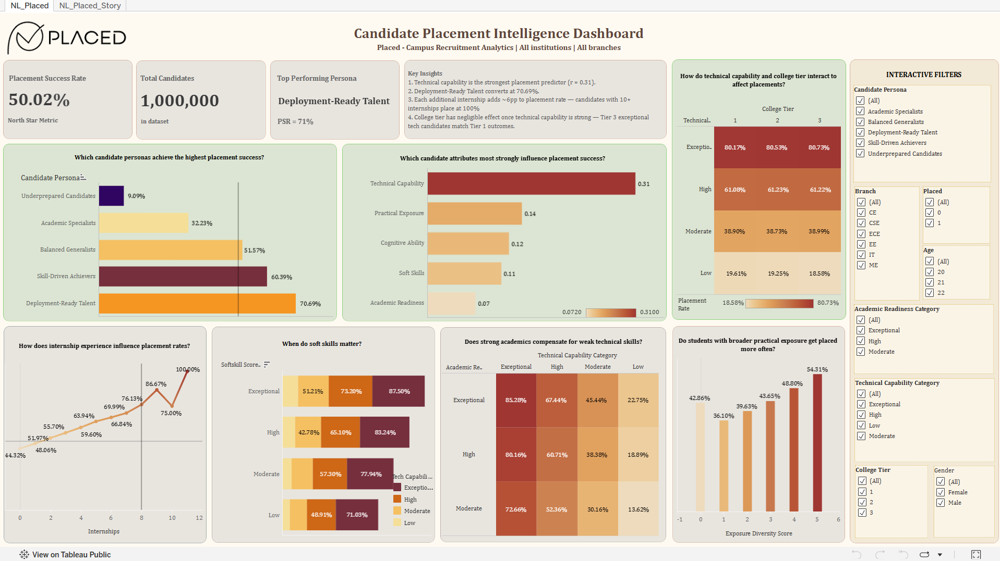

# Candidate Placement Intelligence Dashboard

*Key finding: Technical capability is the single strongest predictor of placement success (r = 0.31) — stronger than academic background or college tier — and once technical capability is strong, college tier barely matters at all.*

## Problem Statement
Placed, a campus recruitment agency, wanted to understand what actually drives placement success across its candidate pool — since strong academic performers weren't always getting placed, while candidates with moderate scores but strong practical skills often were. The goal was to build an interactive Tableau dashboard that helps recruiters and students understand which factors matter most, and segment candidates by their likelihood of placement.

*(Full data cleaning, EDA, and statistical analysis for this project live in the [Python repo](../../Python-Projects/) — this README covers the visualization and dashboard-design side specifically.)*

## Approach
Working from the cleaned and analyzed dataset, I focused on turning the statistical findings into a dashboard a non-technical recruiter could actually use:
- Built KPI cards up top (Placement Success Rate, Total Candidates, Top Performing Persona, Key Insights) so the headline numbers are visible before any drill-down is needed.
- Segmented candidates into five personas — from Underprepared to Deployment-Ready Talent — so recruiters could think in terms of candidate *types* rather than scanning individual scores.
- Layered in interaction-effect views (e.g., technical capability × college tier, academic readiness × technical capability) to show how factors combine, not just how they perform in isolation.
- Built this as both a dashboard and a Tableau Story, walking through problem → key findings → recommendations, consistent with the structure I used in my first Tableau project.

## Key Insights
- Technical capability is the strongest single predictor of placement success (r = 0.31) — well ahead of practical exposure, cognitive ability, soft skills, or academic readiness.
- Deployment-Ready Talent candidates convert at 70.69%, the highest of any persona — more than double the rate of Underprepared Candidates (9.09%).
- Each additional internship raises placement rate by roughly 6 percentage points, with candidates holding 10+ internships placing at 100%.
- College tier has almost no effect once technical capability is strong — a Tier 3 candidate with exceptional technical skills places at nearly the same rate as a Tier 1 candidate (80.73% vs. 80.17%).

## Key Decisions
- I used a **heatmap/matrix** for the technical capability × college tier and academic readiness × technical capability views instead of grouped bar charts — a color gradient makes it possible to spot the strongest and weakest combinations at a glance, which would take much longer to compare across a dozen separate bars.
- I used a **horizontal bar chart with a reference line** for the attribute-influence view (technical capability, practical exposure, cognitive ability, etc.) so viewers could instantly see which factors sit above vs. below the average influence, rather than just reading raw correlation values.
- I built this as a **Tableau Story**, sequencing it as problem context → key findings → recommendations, matching the narrative approach I used in my earlier Swiggy project — so both dashboards give stakeholders a consistent way to move from data to decision.

🔗 [View the interactive dashboard on Tableau Public](https://public.tableau.com/app/profile/sudiksha.gupta/viz/NL_Placed_Dashboard/NL_Placed)
